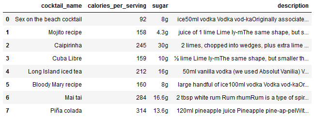

# Cocktail-Prediction

+ [Table of Contents](#sub-sub-heading-1)
    + [Credits](#credits)
    + [Project Goal and procedure](#project-goal-and-procedure)
    + [Code and Resources](#code-and-resources)
    + [Part 1- Scraping Data using Beautiful Soup](#part-1--scraping-data-using-beautiful-soup)
    + [Part 2- Data Cleaning and Feature Engineering](#part-2--data-cleaning-and-feature-engineering)
    + [Part 3- Exploratory Data Analysis](#part-3--exploratory-data-analysis)
    + [Part 4- Model Building](#part-4--model-building)
    + [Part 5- Flask Server](#part-5--flask-server)
    + [Part 6- Project Limitation](#part-6--project-limitation)
    
    

### Credits: 
A big thank you goes to [KenJee](https://www.youtube.com/channel/UCiT9RITQ9PW6BhXK0y2jaeg), [Codebasics](https://www.youtube.com/channel/UCh9nVJoWXmFb7sLApWGcLPQ), [Krish Naik](https://www.youtube.com/user/krishnaik06), [Keith Galli](https://www.youtube.com/channel/UCq6XkhO5SZ66N04IcPbqNcw)  and to the whole [Edureka Team](https://www.youtube.com/user/edurekaIN) who put a lot of effort to teach people Data Science,Machine Learning, Statistics and a lot of other related topics for free.

### Project Goal and Procedure
* Goal: Build a Logistic Regression Model to predict Cocktails based on selected ingredients
* Scraped cocktail information from [www.bbcgoodfood.com](https://www.bbcgoodfood.com/)  
* Dataset was scraped using Python and BeautifulSoup
* Saved results in a csv file and manipulated and worked with the data using the pandas package
* Visualization of data using seaborn and matplotlib packages

### Code and Resources
* Python Version: 3.7
* Environment: Jupyter Notebook
* Packages: Beautiful Soup, Matplotlib, Seaborn, Numpy, Pandas
 
 

# Part 1- Scraping Data using Beautiful Soup
The relevant data for the dataset was extracted by using Beautiful Soup. I wrote a script which was able to scrape the following information:
* Cocktail name
* amount of calories per serving
* amount of sugar information
* description (includes the ingredients which will be extracted in the future steps)

#### I extracted the mentioned information for each cocktail one by one and concatenated the outputs in the last step, so that the pandas dataframe looks like this:

 
 

# Part 2- Data Cleaning and Feature Engineering
After storing the necessary data in a csv file and opening the dataframe by using the pandas dataframe, I cleaned the data entries to make the dataframe machine readable:
* From the 'cocktail name' column I removed every string element so that the cell only contains the cocktail name without any additions
* I created a column for each ingredient. A Python- function looped through the description column and returned a '1' if the particular ingredient is present in a given cocktail, otherwise it returned a '0'
* The Python- function looped searched for the following ingredients:
  * pineapple       * pineapple
  * rum
  * coconut
  * mint
  * lime
  * lemon
  * vodka
  * peach
  * orange

